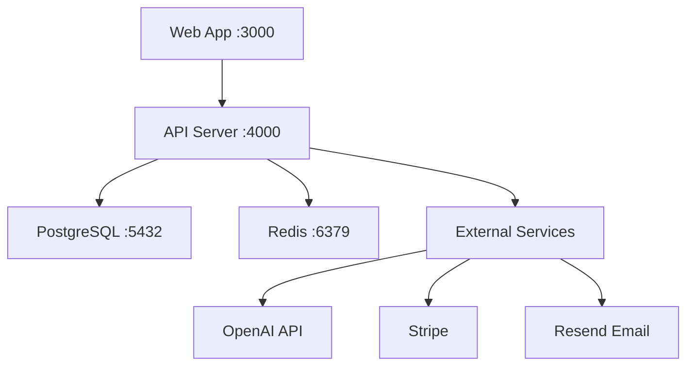

## Overview

OpenSight is designed to be fully self-hosted, giving you complete control over your data and infrastructure. The platform consists of multiple services that work together to provide real-time data analysis and visualization capabilities.

## Architecture

OpenSight uses a microservices architecture with the following components:

### Core Services

<CardGroup cols={2}>
  <Card title="Web Application" icon="browser">
    Next.js 14 frontend with React 18 and TypeScript
    
    **Port:** 3000
  </Card>
  
  <Card title="API Server" icon="server">
    Express backend with TypeScript for data processing
    
    **Port:** 4000
  </Card>
  
  <Card title="PostgreSQL Database" icon="database">
    PostgreSQL 16 for persistent data storage
    
    **Port:** 5432
  </Card>
  
  <Card title="Redis Cache" icon="bolt">
    Redis 7 for high-performance caching
    
    **Port:** 6379
  </Card>
</CardGroup>

### Service Dependencies



## Deployment Options

### Docker Compose (Recommended)

The simplest way to deploy OpenSight is using Docker Compose, which handles all service orchestration automatically.

<Steps>
  <Step title="Clone the repository">
    ```bash
    git clone https://github.com/yourusername/opensight.git
    cd opensight
    ```
  </Step>
  
  <Step title="Configure environment variables">
    ```bash
    cp .env.example .env
    # Edit .env with your configuration
    ```
    
    See [Environment Variables](/deployment/environment-variables) for complete reference.
  </Step>
  
  <Step title="Deploy with Docker Compose">
    ```bash
    docker compose -f docker/docker-compose.yml up -d
    ```
  </Step>
  
  <Step title="Verify deployment">
    ```bash
    docker compose -f docker/docker-compose.yml ps
    ```
    
    Expected output:
    ```
    NAME                IMAGE                   STATUS
    opensight-web-1     opensight-web:latest    Up 30 seconds
    opensight-api-1     opensight-api:latest    Up 30 seconds
    opensight-postgres-1 postgres:16-alpine     Up 30 seconds (healthy)
    opensight-redis-1   redis:7-alpine          Up 30 seconds (healthy)
    ```
  </Step>
</Steps>

See [Docker Deployment](/deployment/docker) for detailed instructions.

### Manual Deployment

For custom deployment scenarios, you can deploy each component separately:

<Steps>
  <Step title="Set up PostgreSQL and Redis">
    Install and configure PostgreSQL 16+ and Redis 7+ on your infrastructure.
  </Step>
  
  <Step title="Build the applications">
    ```bash
    npm install
    npm run build
    ```
  </Step>
  
  <Step title="Run database migrations">
    ```bash
    npm run db:migrate
    ```
  </Step>
  
  <Step title="Start the services">
    ```bash
    # Terminal 1: Start API server
    npm run start:api
    
    # Terminal 2: Start web application
    npm run start:web
    ```
  </Step>
</Steps>

## System Requirements

### Minimum Requirements

- **CPU:** 2 cores
- **RAM:** 4 GB
- **Storage:** 20 GB SSD
- **OS:** Linux (Ubuntu 20.04+, Debian 11+, or similar)

### Recommended Requirements

- **CPU:** 4+ cores
- **RAM:** 8+ GB
- **Storage:** 50+ GB SSD
- **OS:** Linux (Ubuntu 22.04+ or Debian 12+)

### Software Requirements

<AccordionGroup>
  <Accordion title="For Docker Deployment">
    - Docker 24.0+
    - Docker Compose 2.20+
  </Accordion>
  
  <Accordion title="For Manual Deployment">
    - Node.js 20+
    - npm or pnpm package manager
    - PostgreSQL 16+
    - Redis 7+
  </Accordion>
</AccordionGroup>

## Network Configuration

### Default Ports

| Service | Port | Protocol | Required |
|---------|------|----------|----------|
| Web UI | 3000 | HTTP | Yes |
| API Server | 4000 | HTTP | Yes |
| PostgreSQL | 5432 | TCP | Internal |
| Redis | 6379 | TCP | Internal |

### Firewall Rules

If you're deploying behind a firewall, ensure the following ports are accessible:

```bash
# Allow HTTP traffic to web UI
sudo ufw allow 3000/tcp

# Allow HTTP traffic to API
sudo ufw allow 4000/tcp

# PostgreSQL and Redis should only be accessible internally
# Do not expose these ports to the public internet
```

<Warning>
  Never expose PostgreSQL (5432) or Redis (6379) ports directly to the internet. These should only be accessible to the API server within your internal network.
</Warning>

## Data Persistence

OpenSight uses Docker volumes for data persistence:

- **pgdata:** PostgreSQL database files
- **redisdata:** Redis persistence files

These volumes are automatically created and managed by Docker Compose. To back up your data:

```bash
# Backup PostgreSQL
docker compose -f docker/docker-compose.yml exec postgres pg_dump -U opensight opensight > backup.sql

# Backup Redis
docker compose -f docker/docker-compose.yml exec redis redis-cli SAVE
```

## Health Checks

All services include health checks for monitoring:

```bash
# Check service health
docker compose -f docker/docker-compose.yml ps

# View logs
docker compose -f docker/docker-compose.yml logs -f

# Check specific service
docker compose -f docker/docker-compose.yml logs -f api
```

### Health Check Endpoints

- **API Health:** `http://localhost:4000/health`
- **PostgreSQL:** Automatic via `pg_isready`
- **Redis:** Automatic via `redis-cli ping`

## Next Steps

<CardGroup cols={2}>
  <Card title="Docker Deployment" icon="docker" href="/deployment/docker">
    Step-by-step guide for deploying with Docker Compose
  </Card>
  
  <Card title="Environment Variables" icon="gear" href="/deployment/environment-variables">
    Complete reference for all configuration options
  </Card>
  
  <Card title="API Reference" icon="code" href="/api-reference/introduction">
    Explore the API endpoints and integration options
  </Card>
  
  <Card title="Database Setup" icon="database" href="/development/database">
    Configure and manage your PostgreSQL database
  </Card>
</CardGroup>